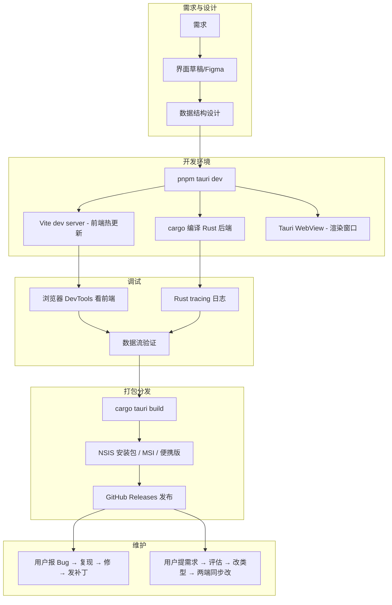

# 开发流程对比：从 Python CLI 到 Rust/Tauri 桌面应用

> 背景：之前习惯用 Python 写面向开发者的 CLI 小工具（无 UI，不打包 exe），
> 现在用 Rust + Tauri 2 开发面向普通用户的桌面软件 Diskwise（磁盘分析 + AI 清理助手）。
> 本文记录两种开发范式的差异和需要建立的新习惯。

---

## 一、之前的舒适区：Python CLI 工具


**能跑通的原因：**
- 用户是自己或同行开发者——天然会装 Python、会用终端
- 不需要 UI——CLI 就是 interface
- 不需要分发包——"能跑就行"，最多打个 wheel
- 不需要兼容——自己用坏了修一下就好

---

## 二、面向用户的产品：多出来的环节



---

## 三、各环节详细对比

### 1. 项目启动

| | Python CLI | Rust + Tauri |
|---|---|---|
| 启动命令 | `python main.py` | `pnpm tauri dev` |
| 背后进程 | 1 个 | 3 个（Vite + cargo + WebView） |
| 启动耗时 | 毫秒 | 秒~十几秒（含编译） |
| 初始状态 | 直接可交互 | 等编译完成才出窗口 |

### 2. 调试方式

| | Python CLI | Rust + Tauri |
|---|---|---|
| 后端调试 | `print()` 看终端 | `tracing` 日志 + 编译器报错 |
| 前端调试 | 无 | 浏览器 DevTools（元素/网络/状态） |
| 数据验证 | 运行时 print 看 | 类型系统 + serde 序列化校验 |
| 改完见效 | 重启脚本（毫秒） | 前端 HMR 即时 / Rust 重编秒到十几秒 |

### 3. 类型系统在开发流程中的作用

```python
# Python：运行时才暴露问题
def scan(path):
    return {"name": "...", "size": "?"}  # 返回啥全靠记
```

```rust
// Rust：编译器逼你做完集成
pub struct Node {
    pub name: String,
    pub path: String,
    pub size: u64,
    pub file_count: u64,  // 改了这个字段
    pub children: Vec<Node>,
    // → 所有用到 Node 的地方编译报错，全得改
}
```

**代价**：编译变慢了
**收益**：编译通过后，运行时错误大幅减少

### 4. 打包和分发

```bash
# 以前：安装 Python 包
pip install my-tool

# 现在：构建桌面安装包
cargo tauri build
# 产出：
#   target/release/bundle/
#   ├── Diskwise_0.1.0_x64-setup.exe  (NSIS 安装器)
#   ├── Diskwise_0.1.0_x64.msi        (Windows Installer)
#   └── Diskwise_0.1.0_x64-portable.exe (绿色版)
# → 上传 GitHub Releases → CI 自动做
```

| | Python CLI | Tauri 桌面应用 |
|---|---|---|
| 交付形式 | pip install / git clone | 双击 exe → 下一步 → 完成 |
| 包体积 | 几十 KB（源码） | 5-10 MB（原生二进制） |
| 用户依赖 | 需装 Python | 无需任何依赖 |
| 更新方式 | `pip install --upgrade` | 下载新版本重装 |
| CI 自动化 | 通常不配 | release.yml 自动编译 + 签名 + 上传 |

### 5. 验证方式

| | Python CLI | Rust + Tauri |
|---|---|---|
| 功能验证 | `python -m pytest` | `cargo test` (Rust) + `pnpm test` (前端) |
| 类型检查 | mypy（可选） | **编译器强制** |
| UI 验证 | 无 | 肉眼 + DevTools 检查 |
| 跨版本验证 | 无 | 需要在不同 Windows 版本上测 |
| 安装包验证 | 无 | 需要测安装→卸载流程 |

### 6. 维护期节奏

```
用户报 Bug →
  1. 复现（可能要在不同 Windows 版本上试）
  2. 修 Rust 端 / 前端 / 两端
  3. 发布补丁版本（tag → CI → release）
  4. 写 CHANGELOG

用户提需求 →
  1. 评估范围和对齐周期
  2. 先改类型定义（types.ts + Rust struct）
  3. 两端同步改
  4. 发布
```

---

## 四、核心维度一览

| 维度 | Python CLI | Rust + Tauri |
|---|---|---|
| 用户画像 | 开发者 | 普通用户 |
| 交互方式 | 终端参数 | GUI 窗口 |
| 启动成本 | 安装 Python 环境 | 双击 e |
| 开发效率 | 高（秒级迭代） | 中等（编译周期长） |
| 运行性能 | 低（解释执行） | 高（原生编译） |
| 包体积 | 几十 KB | 5-10 MB |
| 类型安全 | 运行时检查 | 编译时保证 |
| UI 能力 | 无 / 简单 web | 完整桌面 UI（React） |
| 低层系统能力 | 弱（不适合裸操作） | 强（直接系统调用） |

---

## 五、需要建立的 4 个新习惯

1. **改代码前先定数据结构**
   - Rust：先写 struct
   - 前端：先写 type
   - 数据结构定清楚了，剩下是翻译

2. **接受"改 → 等编译 → 测"的循环**
   - 前几次很烦
   - 但编译通过后基本不出运行时错
   - Rust 端的编译时间主要取决于改动范围

3. **用 GitHub Releases 管理版本**
   - 以前：可能只用 git tag
   - 现在：需要正经的发布流程——版本号 → changelog → tag → CI build → release note

4. **区分开发环境与生产环境**

   | | 开发 | 生产 |
   |---|---|---|
   | 命令 | `pnpm tauri dev` | `pnpm tauri build` |
   | 编译 | debug，快 | release + LTO + strip，慢 |
   | 热更新 | HMR | 纯静态 |
   | DevTools | 可用 | 禁用 |
   | 产物 | 开发目录 | NSIS/MSI 安装包 |

---

## 六、关键命令速查

```bash
# 启动开发环境
pnpm tauri dev

# 仅运行 Rust 测试
cargo test -p crate_name

# 仅运行前端 lint/typecheck
cd apps/desktop && pnpm typecheck

# 构建发布包
pnpm tauri build

# 升级 crate 版本
cargo bump crate_name  # 或手动改 Cargo.toml
```

---

## 七、推荐阅读

- [Tauri 2 官方指南](https://v2.tauri.app/start/)
- [Rust 程序设计（TRPL）](https://doc.rust-lang.org/book/) —— 重点看第 3 章（所有权）、第 8 章（常见集合）、第 10 章（泛型 trait 生命周期）
- [这个项目的 main 分支结构](../README.md)
